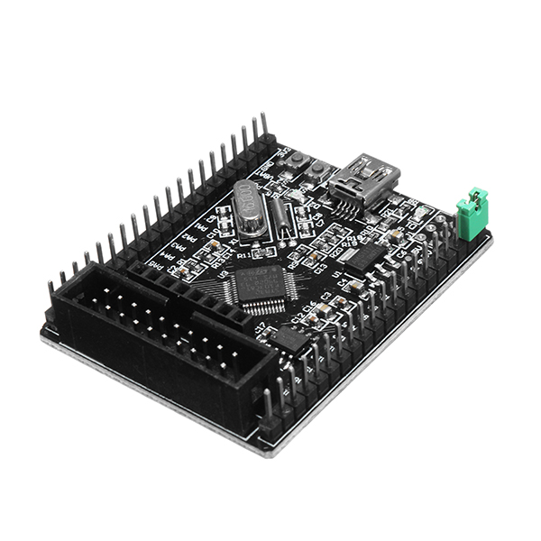

# STM32_Smart_V2.0 STM32F103C8T6

There are two versions with different STM32F1 chips:

* STM32F103C8T6 - 64K flash
* STM32F103C8T6 - 128K flash
* [schematic](Documents/original-schematic-STM32F103C8T6-STM32_Smart_V2.0.pdf)

